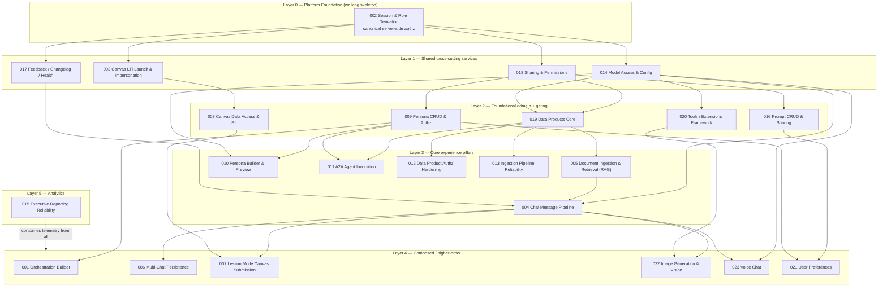

# Spec Sequencing Plan: Dependency-Ordered Build Order

**Created**: 2026-07-21
**Source**: Derived from each spec's `Input` provenance and cross-references under [`specs/`](../specs/), reconciled against [`docs/prd-decomposition-plan.md`](./prd-decomposition-plan.md) and the Technology Stack section of [`.specify/memory/constitution.md`](../.specify/memory/constitution.md).

This plan refines the decomposition plan's product-value **pillar order** into a build-safe **dependency order**. Ordering rule: a spec's layer = `max(dependency layers) + 1`. It exists to keep 23 interdependent specs from each re-deriving (or contradicting) the shared platform skeleton when `/speckit-plan` fans out.

## Dependency graph

## Build order

| Layer | Specs | Why here |
|---|---|---|
| **0 · Foundation** | **002** | The single canonical server-side authorization/session primitive (Constitution Principle II). Everything transitively depends on it. **This is where the walking-skeleton architecture crystallizes**: solution/project layout, DI, data-store wiring (Cosmos/SQL/Search/Redis/Key Vault), telemetry, and the Agent Framework host. |
| **1 · Shared services** | **014, 018, 017, 003** | Each depends only on 002. Model registry (014), unified sharing policy (018), and health/feedback baseline (017) are consumed by nearly every downstream feature. Canvas LTI (003) is identity federation and only needs 002. |
| **2 · Domain + gating** | **019, 020, 009, 016, 008** | Data Products Core (019 ← 002/018/014), tool-gating framework (020 ← 002/014), personas (009 ← 002/018), prompts (016 ← 002/018), Canvas data access (008 ← 003). |
| **3 · Pillars** | **004, 005, 010, 011, 012, 013** | Chat (004) and RAG (005) co-develop — see notes. Persona builder (010 ← 009/014), A2A (011 ← 009/019), Data Product hardening (012 ← 019/018), ingestion reliability (013 ← 019). |
| **4 · Composed** | **001, 006, 007, 022, 023, 021** | Orchestration (001 ← 009/014), multi-chat (006 ← 004/014), lessons (007 ← 003/008/004), image/vision (022 ← 004/014/020), voice (023 ← 004/014), preferences (021 ← 009/016). |
| **5 · Analytics** | **015** | Consumes telemetry produced by everything above; correctly last (P3). |

## Planning nuances

1. **Spec granularity is coarser than story granularity.** Several specs bundle a P1 story with light dependencies alongside P2/P3 stories with heavier ones. The clearest case: **004's core chat (send → stream → persist) only needs 002 + 014**, so it is the *earliest demoable end-to-end slice* and can start the moment Layer 1 lands — even though the *full* spec 004 (RAG grounding via 005, persona-launch via 009, feedback via 017) resolves in Layer 3. When running `/speckit-tasks`, sequence **by story**, not by whole spec.

2. **004 ↔ 005 is a deliberate co-development pair.** RAG retrieval (005) feeds chat (004), while 004's grounding story (REQ-CHAT-7) was explicitly deferred *to* 005. Plan them together in Layer 3, basic-chat-first.

## First three `/speckit-plan` targets

1. **002** — forces the platform skeleton + canonical authz to exist.
2. **014** — model registry; unblocks every model-facing surface.
3. **004 (P1 stories only)** — the first vertical, demoable end-to-end slice, proving the skeleton.
