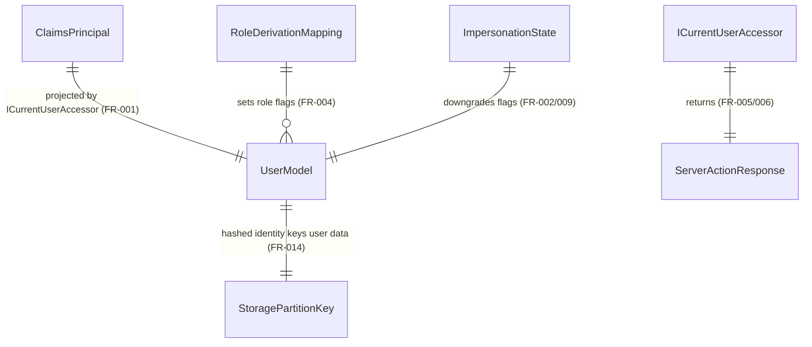

# Phase 1 Data Model: Session Resolution & Role Derivation

**Feature**: 002-session-role-derivation | **Date**: 2026-07-21

These entities are mostly **session-derived** (computed from the authenticated `ClaimsPrincipal`), not persisted rows — except the identity-hash partition key that scopes persisted user data. Source of truth for fields: [spec.md](./spec.md) Key Entities + Functional Requirements; decisions from [research.md](./research.md).

---

## UserModel  *(session-derived, not a DB row)*

The canonical current-user projection returned by `ICurrentUserAccessor` (FR-001).

| Field | Type | Notes |
|---|---|---|
| `Name` | string | From Entra profile claim. |
| `Email` | string | From Entra profile claim; normalized before hashing (see PartitionKey). |
| `Image` | string? | Optional avatar. |
| `Token` | string | Access token handle for downstream calls; **never** serialized to the client (Principle II / Security Constraints). |
| `IsAdmin` | bool | Derived from group claims (FR-004); forced `false` under impersonation (FR-002). |
| `IsEmployee` | bool | Derived from group claims; forced `false` under impersonation. |
| `IsContractor` | bool | Always `false` until an Entra group is configured (Assumption / D9). |
| `IsStudent` | bool | Derived from group claims; forced `true` under impersonation. |
| `AdvancedModelAccess` | bool | Entitlement flag; server-side only. |
| `ImpersonateAsStudent` | bool | Drives the downgrade (Stories 1/4). The *initiation* of impersonation is out of scope (spec 003). |

**Derivation rules**:
- Role flags are set by the single group-GUID → flag mapping (FR-004, D2). Mappings are independent, not mutually exclusive (Story 4).
- When `ImpersonateAsStudent == true`, `RoleDowngrade` forces `IsAdmin/IsEmployee/IsContractor = false` and `IsStudent = true` (FR-002). The downgrade is **idempotent** and **fails closed** (FR-009): if it cannot be evaluated, the principal is treated as most-restrictive/unauthenticated.
- `Token` and any secret-bearing field are excluded from any client-facing accessor structurally (type-level), not by per-call-site convention.

**State**: transient per authenticated request/circuit; no persistence.

---

## RoleDerivationMapping  *(configuration, validated at startup)*

The single configured table consumed by FR-004 (D11).

| Field | Type | Notes |
|---|---|---|
| `GroupId` | GUID (Entra group object id) | Key. |
| `RoleFlag` | enum `{ Admin, Employee, Contractor, Student }` | Target flag. |

**Validation**: bound via Options with `ValidateOnStart`; app boot fails if malformed/empty (Principle V). GUID values are environment/deployment config, not part of the functional contract.

---

## ServerActionResponse\<T\>  *(result envelope)*

The app-wide structured result (FR-005/006, D4).

```text
ServerActionResponse<T> =
  | { Status = OK,          Response: T }
  | { Status = ERROR,       Errors: [{ Message }] }
  | { Status = NOT_FOUND,   Errors: [{ Message }] }
  | { Status = UNAUTHORIZED, Errors: [{ Message }] }
```

| Field | Type | Notes |
|---|---|---|
| `Status` | enum `ResponseStatus` | `OK` / `ERROR` / `NOT_FOUND` / `UNAUTHORIZED`. |
| `Response` | T? | Present only when `Status == OK`. |
| `Errors` | list of `{ Message: string }` | Present on failure; lets callers distinguish "no session" (`UNAUTHORIZED`) from other classes (FR-006). |

No-session `GetCurrentUser()` returns `UNAUTHORIZED` (never a thrown exception).

---

## StoragePartitionKey  *(value object, persisted usage)*

The key that scopes all persisted user-scoped data (FR-014, D8).

| Field | Type | Notes |
|---|---|---|
| `Value` | string | `SHA-256(normalize(email))` digest, where `normalize` = lowercase + trim. |

**Validation / invariants**:
- Deterministic: two casing/whitespace variants of the same email produce the identical key (SC-008).
- Never the raw email.
- Canvas-launched student sessions use the **spec-003 LMS identity-hash scheme** instead of this email-hash scheme (cross-reference, out of scope here).

---

## ImpersonationState  *(session-derived signal)*

| Field | Type | Notes |
|---|---|---|
| `IsActive` | bool | Backs `UserModel.ImpersonateAsStudent`. |

**Rules**: read from a server-trusted claim/state, **never** from client-supplied request data (Principle II). Malformed/unreadable ⇒ treated as most-restrictive (FR-009).

---

## Relationships


