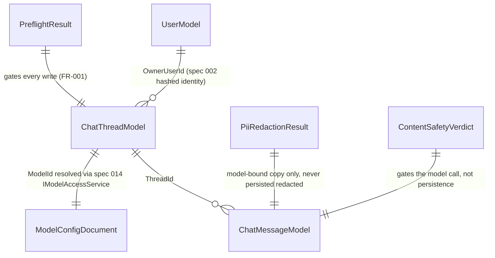

# Phase 1 Data Model: Chat Message Pipeline, Tool Safety & Model Access Control

**Feature**: 004-chat-message-pipeline | **Date**: 2026-07-29

R1-scoped entities only (US1 full, US5 R1 subset). Fields anticipating deferred stories (sharing, compression, artifacts) are noted but not implemented — the schema doesn't block R2, but R2's logic isn't built here. Source of truth: [spec.md](./spec.md) Key Entities; decisions from [research.md](./research.md).

---

## ChatThreadModel  *(Cosmos document)*

| Field | Type | Notes |
|---|---|---|
| `Id` | string (GUID) | PK. |
| `PartitionKey` | string | Spec 002 `StoragePartitionKey` (hashed owner identity) — Cosmos partition key. |
| `OwnerUserId` | string | Same hashed identity as `PartitionKey`, kept as an explicit field for query clarity. |
| `Version` | string | Always `"v3"` for R1-created threads (FR-002). No `v1`/`v2` legacy migration exists in this greenfield build — the version field exists so the read-only-legacy-thread gate (D2) has a real, testable condition, and so a future migration path has somewhere to write an older version. |
| `ModelId` | string | Canonical `provider:modelId` (spec 014), resolved through the access gate at send time — never trusted verbatim from the client on subsequent sends (FR-020/021). |
| `CreatedAtUtc` | DateTimeOffset | |
| `DataProducts` | `string[]` | Server-stored; R1 keeps this empty (data products/spec 019 not yet built) — present so FR-006's override has a real field to defend, not a placeholder. |

**Deferred fields (not implemented, no R2 rework needed to add)**: `IsShared`/`ShareId`/`SharedBy`/`SharedAt`/`ClonedFromShareId`/intended-recipient/expiry (US3); size-tracking toward `MAX_CHAT_THREAD_SIZE` (US7).

---

## ChatMessageModel  *(Cosmos document, separate from ChatThreadModel)*

| Field | Type | Notes |
|---|---|---|
| `Id` | string (GUID) | PK. |
| `PartitionKey` | string | Same hashed owner identity as the parent thread. |
| `ThreadId` | string | FK to `ChatThreadModel.Id`. |
| `Role` | string | `user` \| `assistant`. |
| `Content` | string | For `user`: the **redacted** text actually sent to the model is never persisted raw-vs-redacted distinctly in R1 — the persisted `Content` is the original user-authored text (redaction, D6, applies only to the model-bound copy per FR-008, "never to persisted history"). |
| `CreatedAtUtc` | DateTimeOffset | |

**Deferred fields**: `MessageMetadata.compressionEvent` (US6); artifact references (US9); per-message thumb feedback (US8).

---

## PreflightResult  *(computed, not persisted)*

The result of `IChatPipeline`'s gate checks (D2, FR-001–FR-006).

| Field | Type | Notes |
|---|---|---|
| `IsAllowed` | bool | |
| `RejectionCode` | enum? `{ ThreadReadOnly, MessageTooLong, DailyLimitExceeded }` | Null when `IsAllowed`. |
| `ResetsAtUtc` | DateTimeOffset? | Populated only for `DailyLimitExceeded` (FR-004). |

**Invariant**: when `IsAllowed == false`, the caller (endpoint) MUST NOT have created or modified any `ChatThreadModel`/`ChatMessageModel` document — enforced by ordering (D2), not by this type itself.

---

## PiiRedactionResult  *(computed, not persisted)*

| Field | Type | Notes |
|---|---|---|
| `RedactedText` | string | The model-bound copy — never persisted (FR-008). |
| `RedactionCount` | int | For telemetry only; not a security control by itself. |

---

## ContentSafetyVerdict  *(computed, not persisted)*

| Field | Type | Notes |
|---|---|---|
| `IsAllowed` | bool | |
| `Category` | string? | Populated when blocked (e.g., `hate`, `violence`) — from the Content Safety API response. |

---

## Reused from specs 002/014 (not redefined here)

- `ServerActionResponse<T>` / `ResponseStatus` / `ActionError` (spec 002) — result envelope for the send-message endpoint's non-streaming responses (e.g., preflight rejection).
- `UserModel`, `StoragePartitionKey`, `IIdentityHasher` (spec 002) — caller identity and Cosmos partition key.
- `ModelConfigDocument`, `SystemModelConfig`, `IModelAccessService`, `IModelProviderAdapter` (spec 014) — model registry, effective-access computation, and the request/response adaptation seam `IChatCompletionClient` builds on.

## Relationships

