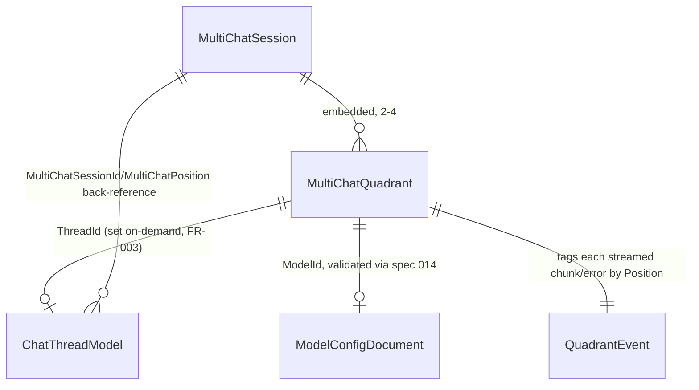

# Phase 1 Data Model: Multi-Chat Session Persistence

**Feature**: 006-multi-chat-session-persistence | **Date**: 2026-07-29

R1-scoped entities only (US1, US2, US4). Source of truth: [spec.md](./spec.md) Key Entities; decisions from [research.md](./research.md).

---

## MultiChatSession  *(Cosmos document, in spec 004's `chat` container)*

| Field | Type | Notes |
|---|---|---|
| `Id` | string | Deterministic per owner (D1) — `"multichat:{PartitionKey}"`. |
| `PartitionKey` | string | Spec 002 `StoragePartitionKey` (hashed owner identity). |
| `OwnerUserId` | string | Same hashed identity as `PartitionKey`, kept for query clarity (matches `ChatThreadModel`'s convention). |
| `Quadrants` | `List<MultiChatQuadrant>` | Length always 2–4 (FR-004/005) — enforced by `IMultiChatSessionStore`, never by the document shape alone. |
| `UpdatedAtUtc` | DateTimeOffset | |

**Invariant**: `Quadrants.Count` is always in `[2, 4]`. Every mutation (add/remove/assign) goes through `IMultiChatSessionStore`, which enforces this before writing (D2) — there is no client-supplied count field at all, mirroring spec 004's "no client-supplied dataProducts parameter" structural guarantee.

---

## MultiChatQuadrant  *(embedded value, not a separate document)*

| Field | Type | Notes |
|---|---|---|
| `Position` | int | 0-based; stable for the quadrant's lifetime (D2 — removal always targets the highest position). |
| `PersonaId` | string? | **Always null in R1** — personas (specs 009/010) aren't built yet. Schema-ready, not functionally wired (plan.md Summary). |
| `ModelId` | string? | Canonical `provider:modelId` (spec 014). The functional R1 assignment — null means "unassigned, no send target." |
| `ThreadId` | string? | Set on first send (FR-003, D3) — null means "no thread created yet for this quadrant." |

---

## ChatThreadModel  *(spec 004, extended — not duplicated)*

Two new nullable fields added to the existing entity (D5):

| Field | Type | Notes |
|---|---|---|
| `MultiChatSessionId` | string? | Null for ordinary (non-multi-chat) threads — every spec 004 call site passes null by default. |
| `MultiChatPosition` | int? | Null for ordinary threads; set alongside `MultiChatSessionId` when a thread is created on-demand for a quadrant. |

All other `ChatThreadModel` fields (`Id`, `PartitionKey`, `OwnerUserId`, `Version`, `ModelId`, `CreatedAtUtc`, `DataProducts`) are unchanged from spec 004.

---

## QuadrantEvent  *(computed, streamed — not persisted)*

The tagged unit written to the fan-in `Channel<QuadrantEvent>` (D4) and serialized as one SSE event.

| Field | Type | Notes |
|---|---|---|
| `Position` | int | Which quadrant this event belongs to — lets the client route it back to the right panel. |
| `Kind` | enum `{ Chunk, Error, Done }` | `Chunk` carries streamed content; `Error` carries a per-quadrant failure (FR-006, D6); `Done` marks that quadrant's stream complete (independent of other quadrants' `Done`). |
| `Content` | string? | The chunk text (`Kind == Chunk`) or a short error code (`Kind == Error`). |

**Invariant**: one quadrant's `Error`/`Done` event never blocks or cancels another quadrant's still-in-flight writer task (D4/D6 — the core of FR-011 and SC-005's "unblocked by other quadrants" guarantee).

---

## Reused from specs 002/004/014 (not redefined here)

- `ServerActionResponse<T>` / `UserModel` / `StoragePartitionKey` / `IIdentityHasher` (spec 002).
- `IChatPipeline` / `ChatSendResult` / `IChatThreadStore` (spec 004) — the parallel-send endpoint calls these directly, once per quadrant.
- `IModelCatalogService` (spec 014) — validates a quadrant's assigned model exists/is enabled before it can be set.

## Relationships

