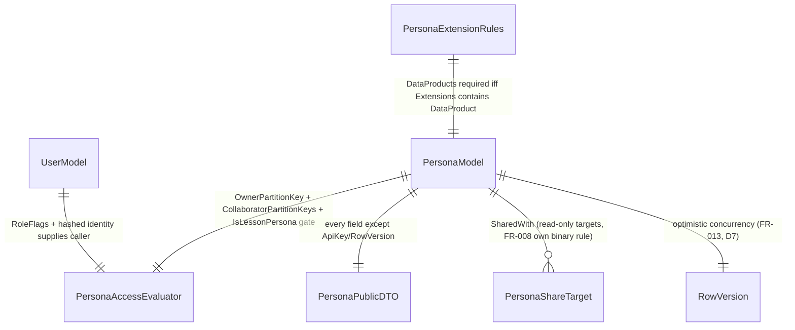

# Phase 1 Data Model: Persona CRUD & Authorization

**Feature**: 009-persona-crud-authorization | **Date**: 2026-08-31

Source of truth for fields: [spec.md](./spec.md) Key Entities + Functional Requirements; decisions from [research.md](./research.md). `PersonaModel` is an **Azure SQL / EF Core** row (D1); `PersonaPublicDTO` is a computed, non-persisted client-safe projection.

---

## `PersonaModel`  *(EF Core entity, Azure SQL)*

| Field | Type | Notes |
|---|---|---|
| `Id` | string (GUID), PK | Persona identity. **Never changes on ownership transfer** — only `OwnerUserId`/`OwnerPartitionKey` change (D1). |
| `OwnerUserId` | string | Current owner's raw identity (e.g. email), for display/audit. Not used for access decisions (see `OwnerPartitionKey`). |
| `OwnerPartitionKey` | string | `IIdentityHasher.ForEmail(OwnerUserId).Value` (D2) — the value `PersonaAccessEvaluator` compares the caller's hashed identity against. |
| `Model` | string | Canonical `provider:modelId` (spec 014), the model this persona invokes. |
| `Name` | string | Required, non-empty. |
| `Description` | string? | Optional. |
| `PersonaMessage` | string | The persona's system/instruction message. |
| `Extensions` | `List<string>` | Open-ended extension tokens (e.g. `"DataProduct"`); stored as JSON via EF Core `ValueConverter`/`ValueComparer` (matches `ModelAccessDbContext`'s existing pattern for list-shaped columns). |
| `DataProducts` | `List<string>` | **Required non-empty when `Extensions` contains `"DataProduct"`** — enforced by `PersonaExtensionRules.TryValidate` (FR-011), not a DB constraint. Same JSON-column pattern as `Extensions`. |
| `CollaboratorPartitionKeys` | `List<string>` | Hashed collaborator identities (D2) — full edit access per FR-003, same JSON-column pattern. |
| `SharedWith` | `List<PersonaShareTarget>` | Read-only share targets (individuals or group tokens) — FR-008's own binary rule, kept as a **separate** list from `CollaboratorPartitionKeys` (not unified with an access-level field, unlike spec 018's `ShareTarget` — see research.md D8). Stored as JSON via a `ValueConverter`. |
| `ApiKey` | string? | The A2A credential (spec 011). **Server-only** — never present on `PersonaPublicDTO` (FR-009/FR-010, D5). |
| `A2aEnabled` | bool | Whether this persona is A2A-invocable (spec 011 owns invocation mechanics; this spec owns the field's existence). |
| `IsLessonPersona` | bool | Admin-managed. Drives student read-only access (FR-003) and non-admin listing exclusion (FR-007). On a non-admin update, the submitted value is discarded server-side — the existing value is preserved (FR-006). |
| `RowVersion` | `Guid`, `IsConcurrencyToken()` | Self-managed optimistic-concurrency token (D7), regenerated by `PersonaService` on every successful write — provider-portable (unlike SQL Server's native auto-generated `rowversion` column type, which the EF Core InMemory provider used in tests doesn't emulate). Any write whose loaded `RowVersion` no longer matches (e.g. a concurrent transfer already committed) throws `DbUpdateConcurrencyException`, mapped to a specific conflict error — this is what implements FR-013's "in-flight transfer" rejection, without a separate boolean flag. |
| `CreatedAtUtc` / `UpdatedAtUtc` | `DateTimeOffset` | Audit trail. |

**Validation invariant** (FR-011, enforced by `PersonaExtensionRules`, not the DB): if `Extensions` contains `"DataProduct"`, `DataProducts` MUST be non-empty (an empty-string-array counts as empty, per spec Edge Cases) — checked on every create/update, server-side, regardless of caller.

**Concurrency invariant** (FR-013, research.md D7): every write includes the loaded `RowVersion` in EF Core's optimistic-concurrency check automatically (`IsConcurrencyToken()`); `PersonaService` regenerates `RowVersion` on every successful write, and catches/maps `DbUpdateConcurrencyException` to the conflict error.

---

## `PersonaPublicDTO`  *(computed, not persisted)*

The **only** shape returned to any Web-layer/Blazor-component-reachable code path (D5). Constructed by mapping every `PersonaModel` field **except** `ApiKey`.

| Field | Type | Notes |
|---|---|---|
| `Id`, `OwnerUserId`, `Model`, `Name`, `Description`, `PersonaMessage`, `Extensions`, `DataProducts`, `CollaboratorPartitionKeys`, `SharedWith`, `A2aEnabled`, `IsLessonPersona`, `CreatedAtUtc`, `UpdatedAtUtc` | (same types as `PersonaModel`) | Direct copies. |
| ~~`ApiKey`~~ | — | **Absent by construction** — not merely omitted by convention (FR-009). |
| ~~`RowVersion`~~ | — | Internal concurrency-control detail; not client-relevant. |

**Structural guarantee** (architecture-tested): `PersonaPublicDTO` has no property named `ApiKey`, checked via reflection in `PersonaSingleImplementationTests` — so a future field addition to `PersonaModel` can't accidentally leak onto the public type without the architecture test failing first.

---

## `PersonaShareTarget`  *(value object, JSON-serialized column on `PersonaModel.SharedWith`)*

| Field | Type | Notes |
|---|---|---|
| `Type` | `PersonaShareTargetType` (`Individual`/`Group`) | Which kind of target. |
| `IdentityPartitionKey` | string? | Set only when `Type == Individual` — hashed via `IIdentityHasher.ForEmail` (D2), same convention as `CollaboratorPartitionKeys`. |
| `GroupToken` | string? | Set only when `Type == Group` — opaque deployment-defined token (e.g. `@employees`), consistent with spec 018's treatment of group tokens as opaque strings. |

**Validation invariant**: exactly one of `IdentityPartitionKey`/`GroupToken` is set, matching `Type` — enforced structurally via named factory methods (`ForIndividual`/`ForGroup`), mirroring spec 018's `ShareTarget` pattern (research.md references this precedent, but `PersonaShareTarget` is 009's own independent type per D8 — not spec 018's `ShareTarget`).

**Role-gating rule** (FR-008, D8): only `Type == Group` targets are gated — an admin caller may add either type; a non-admin caller adding a `Group` target is rejected unconditionally. Resolved via clarification: no company-wide override mechanism exists in this build — that language anticipated 009's future refactor onto spec 018's `SharingDecision`, not a 009-local config to build now.

---

## `PersonaAccessEvaluator`  *(contract, not a data entity)*

See [contracts/service-interfaces.md](./contracts/service-interfaces.md) for the full interface; recorded here because its decision inputs/outputs cross the data-model boundary.

```text
PersonaAccess(persona, caller) =
  Allow(FullAccess)      if caller.IsAdmin
                             or caller.HashedIdentity == persona.OwnerPartitionKey
                             or caller.HashedIdentity in persona.CollaboratorPartitionKeys
  Allow(ReadOnly)         if persona.IsLessonPersona and caller.IsStudent
  Deny(Unauthorized)      otherwise   -- same Status/message for "not found" and "forbidden" (D4)

CanWrite(persona, caller, operation) =
  Deny(Unauthorized)      if PersonaAccess(persona, caller) != FullAccess
  Deny(LessonPersonaBlocked)  if persona.IsLessonPersona and !caller.IsAdmin and operation in {Edit, Delete}
  Allow                   otherwise
```

---

## Relationships


