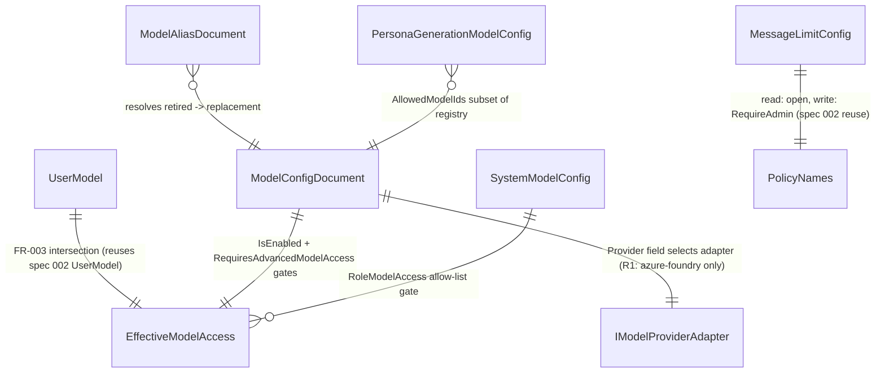

# Phase 1 Data Model: Model & Access Configuration Management

**Feature**: 014-model-access-config-management | **Date**: 2026-07-28

Source of truth for fields: [spec.md](./spec.md) Key Entities + Functional Requirements; decisions from [research.md](./research.md). All entities below are **Azure SQL / EF Core** rows (D1) except `EffectiveModelAccess`, which is computed, never persisted.

---

## SystemModelConfig  *(admin singleton)*

| Field | Type | Notes |
|---|---|---|
| `Id` | int (singleton row, `Id = 1`) | Enforced single row via seed + no insert path beyond seed. |
| `RoleModelAccess` | JSON column: `{ admin: string[] \| "*", staff: ..., faculty: ..., student: ..., default: ... }` | Per-role allow-list of model canonical IDs, or `"*"` for all. |
| `EmbeddingModelId` | string? | Canonical model ID for embeddings. |
| `ImageModelId` | string? | Canonical model ID for image generation (R2 — spec 022). |
| `ArtifactModelId` | string? | Canonical model ID for artifact generation (out of R1 chat scope). |
| `FallbackModelId` | string | Canonical model ID used when a caller's resolved model is unavailable. |
| `UpdatedAtUtc` | DateTimeOffset | Audit trail for admin mutation. |
| `UpdatedByUserId` | string | Hashed identity (spec 002 `StoragePartitionKey`-style), never raw email. |

**Read path**: cached in Redis, fallback to SQL, fallback to hardcoded defaults (D2, FR-014/SC-010). **Write path**: `RequireAdmin` only (FR-001).

---

## ModelConfigDocument  *(per-model registry entry)*

| Field | Type | Notes |
|---|---|---|
| `Id` | string, PK | Canonical `provider:modelId` form (FR-011), e.g. `azure-foundry:gpt-5`. |
| `DisplayName` | string | Human-readable name shown in chat UI. |
| `Provider` | string | e.g. `azure-foundry` (R1); `anthropic`, `vertex`, `deepseek`, etc. (R2). |
| `IsEnabled` | bool | Gate 1 of the FR-003 intersection. |
| `RequiresAdvancedModelAccess` | bool | Gate 3 of the FR-003 intersection (only applies when true). |
| `SupportsToolCalling` | bool | Capability flag (FR-011). Required, no implicit default (Edge Cases). |
| `SupportsVision` | bool | Capability flag. Required, no implicit default. |
| `SupportsReasoning` | bool | Capability flag. Required, no implicit default. |
| `AccessTier` | enum `{ Standard, Advanced }` | Drives UI/cost-routing decisions (constitution WAF Cost Optimization). |
| `ContextWindowSize` | int | Tokens. |
| `PricingInputPerMTok` / `PricingOutputPerMTok` | decimal | For cost-routing/telemetry. |
| `IsDeleted` | bool | Soft-delete flag (D4, FR-002). Never physically removed. |

**Validation invariant**: a model with any capability flag unset (null, not defaulted) MUST be rejected at write time — the Edge Case explicitly requires an explicit value rather than a silent "supported" default.

**Query shapes**: default query (EF Core global filter) excludes `IsDeleted == true`; an explicit `IncludeDeleted()` query path exists for resolving historical persona/thread references (D4 Edge Case).

---

## ModelAliasDocument  *(retired → replacement mapping)*

| Field | Type | Notes |
|---|---|---|
| `RetiredModelId` | string, PK | Canonical ID of the retired model. |
| `ReplacementModelId` | string | Canonical ID of the current model to resolve to. |

**Rule**: resolving a model reference checks this table first; if the retired ID is aliased, the replacement's `ModelConfigDocument` governs access — the retired model's own soft-deleted row is never re-activated.

---

## MessageLimitConfig  *(read-open, write-admin-gated)*

| Field | Type | Notes |
|---|---|---|
| `Id` | int (singleton row) | Same singleton pattern as `SystemModelConfig`. |
| `PerMessageCharacterCap` | int? | Nullable = disabled. Server-validated ≥1 integer when set (FR-008). |
| `DailyMessageCap` | int? | Nullable = disabled. Server-validated ≥1 integer when set (FR-008). |
| `UpdatedAtUtc` / `UpdatedByUserId` | DateTimeOffset / string | Audit trail. |

**Read path** (D5): open to any authenticated caller (FR-004). **Fresh-tenant default** (Edge Cases): if no row exists yet, the read path returns `{ PerMessageCharacterCap: null, DailyMessageCap: null }` (both disabled) rather than erroring. **Write path**: `RequireAdmin` (FR-006), re-validated server-side regardless of client input (FR-008).

---

## PersonaGenerationModelConfig  *(read-open, write-admin-gated)*

| Field | Type | Notes |
|---|---|---|
| `Id` | int (singleton row) | Same singleton pattern. |
| `AllowedModelIds` | JSON column: `string[]` | Pre-filtered subset of `ModelConfigDocument.Id` values eligible for persona-generation. |
| `UpdatedAtUtc` / `UpdatedByUserId` | DateTimeOffset / string | Audit trail. |

**Read path**: open to any authenticated caller (FR-005). **Write path**: `RequireAdmin` (FR-007); a submitted `modelId` MUST already be in `AllowedModelIds` for the write to be treated as valid **selection** — but the *admin* write that edits `AllowedModelIds` itself is validated against the general `ModelConfigDocument` registry (a model must exist and not be deleted to be added to the allow-list). **Empty/misconfigured allow-list** (Edge Cases): persona generation fails closed with an actionable error; it never silently falls back to the general registry (FR-009 corollary).

---

## EffectiveModelAccess  *(computed, not persisted)*

The result of `ComputeEffectiveAccess` (D3) — the actual per-caller, per-model decision.

```text
EffectiveModelAccess(model, user) =
  model.IsEnabled
  ∧ RoleAllowListed(model.Id, user.Roles, SystemModelConfig.RoleModelAccess)
  ∧ (!model.RequiresAdvancedModelAccess ∨ user.AdvancedModelAccess)
```

| Field | Type | Notes |
|---|---|---|
| `ModelId` | string | Echo of the evaluated model's canonical ID. |
| `IsAvailable` | bool | Final intersection result. |

**Invariant**: `AdvancedModelAccess == true` never overrides a missing role-allow-list entry — both conditions are required, never either/or (Edge Cases, explicit non-override rule).

---

## IModelProviderAdapter  *(contract, not a data entity)*

See [contracts/service-interfaces.md](./contracts/service-interfaces.md) for the full interface; recorded here because request/response shapes cross the data-model boundary at the provider call site (D8).

---

## Relationships


