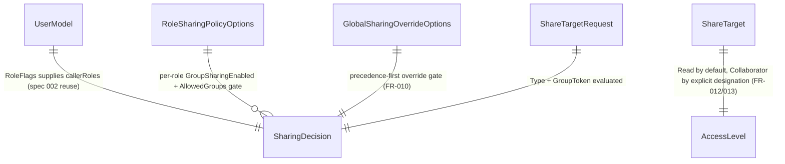

# Phase 1 Data Model: Sharing & Permissions Policy

**Feature**: 018-sharing-permissions | **Date**: 2026-08-31

Source of truth for fields: [spec.md](./spec.md) Key Entities + Functional Requirements; decisions from [research.md](./research.md). **Every entity below is a plain in-memory value type — none are persisted** (D1); `RoleSharingPolicyOptions`/`GlobalSharingOverrideOptions` are `IOptions`-bound config snapshots, and `SharingDecision` is computed fresh on every call, never cached or stored.

---

## `ShareTargetType`  *(enum)*

```text
Individual | Group
```

## `AccessLevel`  *(enum)*

```text
Read | Collaborator
```

**Rule** (FR-012/FR-013): a `ShareTarget` defaults to `Read`; `Collaborator` requires explicit designation by the owner — it is never implied by target type or by being a `Group` member.

---

## `ShareTarget`

| Field | Type | Notes |
|---|---|---|
| `Type` | `ShareTargetType` | `Individual` or `Group`. |
| `Identity` | string? | Individual identity (email), set only when `Type == Individual`. |
| `GroupToken` | string? | Deployment-defined group token (e.g. `admins`, `students`, `@employees`, `announcements`), set only when `Type == Group`. Corresponds to spec.md's `Group` Key Entity — represented here as an opaque string, not a distinct type, per spec Edge Cases (group catalogs are deployment-configured, not a fixed enum). |
| `AccessLevel` | `AccessLevel` | `Read` by default; `Collaborator` only when the owner explicitly designates it (FR-012/FR-013). |

**Validation invariant**: exactly one of `Identity`/`GroupToken` is set, matching `Type`. This is a shape invariant for 018's own request/decision types; enforcing it against a real persisted resource (e.g. a persona's `sharedWith` list) is each consumer spec's (009/012/016) own concern, not 018's.

---

## `ShareTargetRequest`  *(evaluator input, not persisted)*

| Field | Type | Notes |
|---|---|---|
| `Type` | `ShareTargetType` | What the caller is attempting to share with. |
| `GroupToken` | string? | Set only when `Type == Group`; ignored when `Type == Individual` (FR-004/FR-005 — individual sharing is not group-gated). |

**Note**: deliberately narrower than `ShareTarget` — the evaluator only needs to know *what kind* of target and *which group* to decide allow/deny; it has no opinion on the target's identity value or the requested access level (access level is governed by FR-012/FR-013 as a separate, unconditional rule, not part of the allow/deny decision).

---

## `RoleSharingPolicyOptions`  *(IOptions-bound, one entry per non-admin `RoleName`)*

| Field | Type | Notes |
|---|---|---|
| `Roles` | `Dictionary<RoleName, RolePolicy>` | Keyed by the real, already-implemented `RoleName` enum (`Employee`, `Contractor`, `Student` — **not** `Admin`; see research.md D2/D3). Entries are optional per role (see fail-safe default below) rather than `[Required]` for every key. |

### `RolePolicy`  *(nested)*

| Field | Type | Notes |
|---|---|---|
| `GroupSharingEnabled` | bool | Whether this role may share with groups at all (FR-004/FR-005). Individual sharing is always allowed regardless of this flag — not represented here (D3). |
| `AllowedGroups` | `string[]` | Group tokens this role may target when `GroupSharingEnabled` is true. `[Required]` (may be empty, meaning group-sharing is enabled in name only until configured). |

**Validation invariant**: `Admin` MUST NOT appear as a key — admin's "share with everything" behavior is hardcoded in the evaluator (D3), never config-driven, so a config entry for `Admin` would be dead/misleading and is rejected at startup.

**Fail-safe default for unconfigured roles**: spec.md defines policy only for `Employee`/`Student` (mapped from "faculty"/"student" — see spec Assumptions); `Contractor` has no spec-defined policy. Rather than requiring every non-admin `RoleName` to have an explicit entry (which would force guessing Contractor's correct values), a `RoleName` absent from `Roles` evaluates as `GroupSharingEnabled = false, AllowedGroups = []` — the most restrictive policy, per Principle III (fail loud/fail closed applied to an undefined product decision, not a silent unsafe default). This is a temporary posture until a `/speckit.clarify` pass defines Contractor's actual policy.

**appsettings.json shape** — see [contracts/config-schema.md](./contracts/config-schema.md).

---

## `GlobalSharingOverrideOptions`  *(IOptions-bound, singleton)*

| Field | Type | Notes |
|---|---|---|
| `DisableAllGroupSharing` | bool | FR-007. When true, all non-admin group-target requests are denied; individual sharing is unaffected. |
| `AdminOnlyMode` | bool | FR-008. When true, all non-admin requests (individual or group) are denied. |
| `GloballyAllowedGroups` | `string[]` | FR-009. Group tokens shareable by any role regardless of that role's own `AllowedGroups` — additive, never subtractive (spec Edge Cases). `[Required]` (may be empty). |

**Rule** (FR-011): these fields govern new share operations only — 018 has no concept of an existing grant to revoke, since it persists nothing; "not revoking existing access" is trivially true here and becomes a real constraint only for 009/012/016's own storage when they adopt this policy.

**appsettings.json shape** — see [contracts/config-schema.md](./contracts/config-schema.md).

---

## `SharingDecision`  *(computed, not persisted)*

The result of `SharingPolicyEvaluator.Evaluate` (research.md D5/D6) — the actual per-caller, per-request decision every consumer (009/012/016) is meant to trust instead of re-deriving.

```text
SharingDecision(callerRoles, request, rolePolicy, globalOverride) =
  match request.Type:
    Individual ->
      Allow                                     if !globalOverride.AdminOnlyMode || callerRoles.IsAdmin
      Deny(AdminOnlyModeActive)                 otherwise
    Group ->
      Deny(AdminOnlyModeActive)                 if globalOverride.AdminOnlyMode && !callerRoles.IsAdmin
      Allow(AdminBypass)                        if callerRoles.IsAdmin
      Deny(GroupSharingDisabledGlobally)        if globalOverride.DisableAllGroupSharing
      Allow(GloballyAllowedGroup)               if request.GroupToken in globalOverride.GloballyAllowedGroups
      Allow(RolePolicyAllowed)                  if any role r in callerRoles where
                                                    rolePolicy.Roles.GetValueOrDefault(r, RolePolicy.Default).GroupSharingEnabled
                                                    && request.GroupToken in rolePolicy.Roles.GetValueOrDefault(r, RolePolicy.Default).AllowedGroups
      Deny(RolePolicyDenied)                    otherwise
      // RolePolicy.Default = { GroupSharingEnabled: false, AllowedGroups: [] } — fail-safe for a role
      // absent from config (e.g. unconfigured Contractor), never a KeyNotFoundException.
```

| Field | Type | Notes |
|---|---|---|
| `IsAllowed` | bool | Final allow/deny result. |
| `Reason` | `SharingDecisionReason` (enum) | One of the tagged outcomes above (`AdminOnlyModeActive`, `AdminBypass`, `GroupSharingDisabledGlobally`, `GloballyAllowedGroup`, `RolePolicyAllowed`, `RolePolicyDenied`) — exists purely for testability/observability (Principle VI: each maps to one FR/SC), not part of any persisted record. |

**Invariant**: `AdminOnlyMode` and `DisableAllGroupSharing` are both checked before any per-role or globally-allowed-group check, matching FR-010's precedence rule verbatim; `GloballyAllowedGroup` and `RolePolicyAllowed` are additive, never a source of denial for each other (spec Edge Cases).

---

## Relationships


